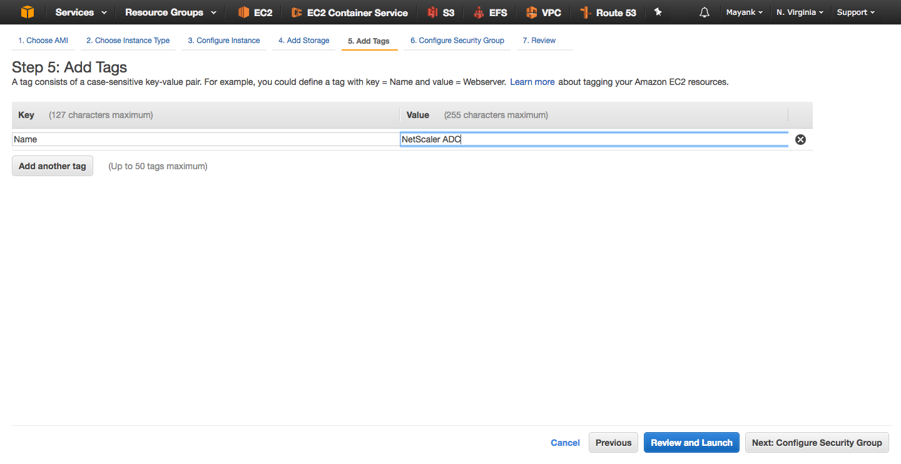

# [NetScaler ADC in AWS](#Deploy-NS) #

[Citrix NetScaler on Amazon Web Services (AWS)](https://aws.amazon.com/marketplace/search/results?x=0&y=0&searchTerms=Citrix+Netscaler+ADC&page=1&ref_=nav_search_box) enables enterprises to rapidly and cost-effectively leverage world-class [NetScaler application delivery capabilities](https://www.citrix.com/products/netscaler-adc/) within their Amazon Web Services deployments. NetScaler on AWS combines the elasticity and flexibility of the AWS Cloud with the same optimization, security and control NetScaler provides for the most demanding websites and applications in the world. Because the corresponding Amazon Machine Image (AMI) is a packaging of the same binary used on NetScaler MPX™/NetScaler SDX™ hardware and NetScaler VPX™ virtual appliances, enterprises obtain all of the same L4-7 functionality familiar from their on-premise deployments, including load balancing, content switching, global server load balancing, application firewall and SSL VPN. This enables numerous compelling use cases, from hybrid cloud (i.e., spillover) and production delivery scenarios, to implementations for business continuity and application development and testing.

**Note:** There are many ways of deploying a NetScaler VPX in the cloud
  
  1. [Explicitly via the Market Place](https://aws.amazon.com/marketplace/search/results?x=0&y=0&searchTerms=netscaler&page=1&ref_=nav_search_box)
  2. [CloudFormation Template](https://console.aws.amazon.com/cloudformation/designer/home?templateURL=https%3A%2F%2Fs3.amazonaws.com%2Fawsmp-fulfillment-cf-templates-prod%2F63425ded-82f0-4b54-8cdd-6ec8b94bd4f8.01d3948e-aa71-48a7-8253-24fe14fc049b.template&region=us-east-1)
  3. Single click Deploy (Hyperlink reference comming soon)

In this section, we will show you can Deploy NetScaler ADC in AWS from the Market Place within your VPC to front end a simple, load balanced web application. Later we will explore other methods to deploy NetScaler using CloudFormation templates. 

##  [Overview](#Deploy-NS-Overview) ##
Before we begin, I want to outline our objectives in this module. In this module we will :
  
  1. Provision a NetScaler ADC VPX 10 EC2 instance
    * It's default interface will reside on the management network interface with a static IP of `172.16.10.100`.
    * This instance will have an additional NIC on the server subnet with a static IP of `172.16.20.100`. 
  2. Logon to the NetScaler VPX management web console
    * Assign a [SNIP](https://docs.citrix.com/en-us/netscaler/11/networking/ip-addressing/configuring-netscaler-owned-ip-addresses/configuring-subnet-ip-addresses-snips.html) and update the NetScaler's routing table to use the *Server Subnet*'s gateway that will forward all internet access to the internet via the [NAT Gateway](../VPC#Server-RT).
    * Configure a nameserver for DNS resolution. 
  3. Configure public facing [ENI](http://docs.aws.amazon.com/AWSEC2/latest/UserGuide/using-eni.html). 
    * Assign a private IP to the ENI of `172.16.30.100` and associate it with an [Elastic IP](http://docs.aws.amazon.com/AWSEC2/latest/UserGuide/elastic-ip-addresses-eip.html) for direct access via a public IP. 
  4. Configure a simple Load balancer. 
    * This Load Balancer will have an IP of `172.16.30.100` and load balance the web service hosted on the linux EC2 isntance from the [EC2 module](../EC2/Ubuntu-EC2#Host-Webservers).

## [Provision a NetScaler ADC VPX 10](#Deploy-NS-Provision) ##

Lets beign by launching an NetScaker VPX 10 Standard Edition EC2 instance, similar to how we did for our [Windows 2016 server](../Windows-EC2) and [Ubuntu 16.04 Server](../Ubuntu-EC2). 

1. Click on ***"Launch Instance"*** under *Create Instance* heading within the [EC2 dashboard](https://console.aws.amazon.com/ec2/). 

2. Within 'AWS Marketplace' search for "*NetScaler VPX 10*" and select '*NetScaler VPX Standard Edition - 10 Mbps*'

3. Accept the notification mentioning the cost associated with the instance. 

4. Select a m4.xlarge instance type to deploy. Click **Next: Configure Instance Details** to continue.
    
    

5. In the "Configure Instance Details" enter in the following parameters: 
    * **Number of Instances**: 1
    * **Purchasing Options**: Unchecked
    * **Network**: 'Demo-VPC'
    * **Subnet**: 'MGMT'
    * **Auto-assign Public IP**: Disable
    * **Placement Group**: No Placement Group
    * **IAM Role**: None
    * **Shutdown Behaviour**: Stop
    * **Enable termination protection**: Unchecked
    * **Monitoring**: Unchecked
    * **Tenancy**: Shared

    Under *Network Interfaces* enter the first interface's private IP as `172.16.10.100` and attach another interface on the **Server** subnet with private IP of `172.16.20.100` as shown in the screen shot. 

    
    
    Click **Next: Add Storage** to continue.

6. Leave as 30 GB default size *Root* Volume Type. We will provision as a *General Purpose SSD (GP2)* Non encrypted.
  
  Click **Next: Add Tags** to continue.

7. Click **Add Tag** GUI button to add: 
    * Key: *Name*
    * Value: *Netscaler ADC*

    
    Click **Next: Configure Security Groups** to continue.

8. Keep the default recomendations for Security Group rules. Enter **NetScaler VPX** for the Security Group Name. 

    
    Click **Review and Launch** to continue.

9. Review the EC2 instance details and click **Launch** to provision the NetScaler ADC.

    
    
    * You will be prompted to "Select an existing key pair or create a new key pair".
    * Select "Demo-Key-Pair" from the previous EC2 modules, otherwise create a new one and save to a known secure   location. 
    * Click **Launch Instance** to begin provisioning your NetScaler VPX instance. 
    
    

> **NOTE:** Wait for approximately 5-10 min. before your proceed and until the NetScaler instance has completed initializing. You can view the status of the instance under the [EC2 Dashboard](https://console.aws.amazon.com/ec2/) within the *Status Checks* column. 
    

## [Configure NetScaler VPX via web console](#Deploy-NS-Config) ##

1. [RDP into a EC2 Windows machine](../Windows-EC2/README.md#Windows-RDP) and open up a internet browser (perferably Chrome Browser) to navigate to NetScaler ADC's Management console at `https://172.16.10.100`. 
      
    Use the **Username:** `nsroot` and **Password:** `<Instance-ID>` from your AWS EC2 Console to logon. You instance id may be similar in format to : `i-0f3af8dadf60a542d`. 

    

2. Once you have logged into NetScaler's management console, navigate to **System > Network > IP** in the left hand pane. 
    

    Here you will notice only a single IP owned by the NetScaler ADC. The NetScaler is not aware of any additional IPs the instance may own (like the `172.16.20.100` IP in the **Server** subnet we provided during provisioning). The NetScaler only by default knows of its own default (management) IP when provisioned. 

    Add the second IP of `172.16.20.100` to the NetScaler as a [SNIP](https://docs.citrix.com/en-us/netscaler/11/networking/ip-addressing/configuring-netscaler-owned-ip-addresses/configuring-subnet-ip-addresses-snips.html) for backend server communication. 

    Begin by clicking on **Add** GUI button and enter the following: 
      
      * **IP Address:** `172.16.20.100`
      * **Netmask:** `255.255.255.0`
      * **IP Type:** SNIP
      * Leave all other settings as default except remeber to **uncheck** "Enable Management Access control to support the below listed applications"
      * Confirm 'Yes' to the pop-up dialogue. 

      

3. Next we will set the default route to the **Server** subnet's gateway therefore the NetScaler ADC will use the NAT gateway defined by the **Server** subnet's routing table. 

  > **Note:** The first IP of each subnet within a VPC is reserved for the subnet's gateway or VPC's internal router. This will be the IP we use from the **Server** subnet as our default gateway on the NetScaler ADC. 

  Navigate to **System > Network > Routes** in the left hand pane. 

  

  Here you will notice that the default route uses the `172.16.10.1` IP from the management subnet. Remove this route and add an new default route using the `172.16.20.1` IP as the gateway. Now that we have a SNIP (`172.16.20.100`) in the **Server** subnet, we can resolve the `172.16.20.0/24` network. 

  

  Now the NetScaler has outbound internet access via the NAT gateway, a NSIP in the **Management** subnet, and a SNIP in the **Server** subnet. Next we will configure an additional network interface for VIPs in the **Client** subnet. 

## [Configure public facing ENI](./Deploy-NS#Deploy-NS-Public-ENI) ##

1. Begin by navigating to **Network Interfaces** under *Network & Security* within the left pane of the [EC2 Dashboard](https://console.aws.amazon.com/ec2/). 

2. Click **Create Network Interface** GUI to create a new ENI. Give it:
    * **Description:** *Client-ENI*
    * **Subnet:** *Client*
    * **Private IP:** `172.16.30.100`
    * **Security Group:** Backend-Webservers

  Once created, select the interface and attach it to the NetScaler EC2 instance. 

  

3. Reboot the instace from the [EC2 Dashboard](https://console.aws.amazon.com/ec2/). Note that a warm or hot attach of an additional network interface like this requires you to manually bring up the second interface (by rebooting or via CLI. [Only instances running Amazon Linux or Windows Server automatically recognize the warm or hot attach and configure themselves.](http://docs.aws.amazon.com/AWSEC2/latest/UserGuide/using-eni.html) The NetScaler VPX in AWS does not. 

  

4. After reboot has successfully completed, proceed to the next module to configure a simple Load Balancer to front end [Webserver-A and Webserver-B](../Ubuntu-EC2#Host-Webservers) websites hosted on the [Ubuntu host](../Ubuntu-EC2).

## [Configure a simple Load balancer](./Deploy-NS#Deploy-NS-LoadBalancer) ##

Loggon to the NetScaler management console within your RDP session and navigate to `Traffic Management > Load Balancing` in the left hand pane. Right click `Load Balancing` to enable the feature. Here we will set up a simple Load balancer front end to your backend website. 

### [1. Add a Backend Server](#lb-server) ###

Navigate to `Servers` within `Load Balancing` and click the `Add` GUI button to add the Ubuntu host created in the **Server** subnet. 

Enter: 
    * **Name:** DockerHost
    * **IP Address:** Select Radio Button
    * **IP Address***: `172.16.20.10`

  Click `Create` when completed to add a backend server to define a service to. 
  
  

### [2. Add Webserver-A Service ](#lb-webservice-1) ###

Navigate to `Services` within `Load Balancing` and click the `Add` GUI button.
  
  

Enter: 

  * **Service Name:** WebSite-A
  * **Existing Server:** Select Radio Button
  * **Server***: Dockerhost (172.16.20.10)
  * **Protocol:** HTTP
  * **Port**: 9090

  Click **OK** to continue configuring the service

  

  Once complete, click **Done** GUI button at the bottom. 

### [3. Add Webserver-B Service ](#lb-webservice-2) ###

Now we will add the **second website** as a service definition within NetScaler. It is a very similar process. Begin by navigating to `Services` within `Load Balancing` and click the `Add` GUI button.
  
  

Enter: 

  * **Service Name:** WebSite-B
  * **Existing Server:** Select Radio Button
  * **Server***: Dockerhost (172.16.20.10)
  * **Protocol:** HTTP
  * **Port**: 9091

  Click **OK** to continue configuring the service

  

  Once complete, click **Done** GUI button at the bottom. 

  When you have added both of your services, click the refresh icon at the top of the `Traffic Management > Load Balancing > Services` page and notice both of your services should show a status of `UP`

  

### [4. Define a Load Balancing vServer](#lb-vserver) ###

Navigate to `Virtual Servers` within `Load Balancing` and click the `Add` GUI button.
  

Enter: 

  * **Name:** Website
  * **Protocol:** HTTP
  * **IP Address Type:** IP Address
  * **IP Address:** `172.16.30.100`

  > Note: This is the private IP we assigned the [public facing ENI](#Deploy-NS-Public-ENI)
  
  * **Port**: 80

  > Note: This will be the external facing port we navigate to resolve the load balanced services. Make sure this port is open and defined in your Security Group associated with your Public ENI attached to the NetScaler ADC. 

Click **OK** when completed to proceed. 

Now click the "No Load Balancing Virtual Server Service Binding" under the "Service and Service GRoups" pane in the middle of the page. 

Bind both services defined in the previous page to the vServer. Use the animation below for reference. 

Click **Done** once complete and observe that the virtual server "Website" shows as `UP` under **State** and **Effective State**

> Note: By default, the load balancing method is set as Round Robin. Please see [official documentation](http://docs.citrix.com/zh-cn/netscaler/11/traffic-management/load-balancing/load-balancing-setup.html) for more advanced settings and configurations for defining Load Balancing virtual servers and services on the NetScaler. 

### [5. Enable External Access to NetScaler's Load Balancing Virtual Server](#lb-vserver-external) ###

Now we can validate that our webpages are being load balanced internally on the `172.16.30.100` IP by navigatign to `http://172.16.30.100` on a browser within our RDP session and continuously hitting refresh on the browser -- As shown here: 

Now we will make configurations on AWS' console to allow direct, public access to the LoadBalancing Virtual Server on the NetScaler ADC. 

1. Within the [EC2 dashboard](https://console.aws.amazon.com/ec2/), navigate to `Instances` from the left navigation pane and select the **NetScale ADC** EC2 instance. Once highlighted, note down the interface ID of the [public ENI](#Deploy-NS-Public-ENI) or likley labled as `eth2` (it will read similar to: `eni-f11fb02c`). 

2. Next, navigate to **Elastic IPs** under Network and Security in the left navigation pane. Click **Allocate new address** which will provide you with a free public IP to use and associate with a EC2 instance. 

3. Once allocated, **select the new EIP** which does not have a Network Interface nor an Instance associated with it and click the drop down **Actions** GUI button to select **Associate Address**. 

4. Select **Network Interface** and enter in the public ENI (eth2) interface ID into the filter bar and select the interface. 

5. Select the desired private IP owned by the ENI (in our case it should only popualte with `172.16.30.100`). We want to select ths Load Balancer's IP (VIP) for association. 

6. Click **Associate** 

Refer to the following animation for guidance: 

Once completed. Open up any browser connected to the internet from any enpoint (your laptop for example) and navigate to your Elastic IP allocated from above. You should be able to refresh the page continously and see **Webserver A** and **Webserver B** load balance throughout. 

## [Summary](#EC2-Summary) ##

	
 

