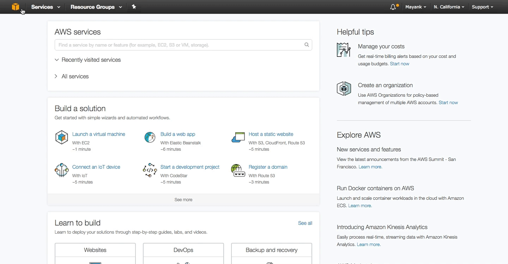

# [Compute in AWS (EC2)](#EC2) #
In this Section we will explore how to launch compute resources in AWS. If you have not already done so, logon to [https://consle.aws.amazon.com](https://consol.aws.amazon.com) to gain access to the AWS dashboard. Once you have logged in, near the top left you will notice a "Service" drop down which lists all of your services availible that you can subscribe to and consume for your cloud infrastructure. For configuring our cloud's computer resources, we will primarily be working in the EC2 dashboard. Click on EC2 under services to enter the [EC2 dashboard](https://console.aws.amazon.com/ec2/). 

Once you're in the [EC2 dashboard](https://console.aws.amazon.com/ec2/), you will notice in the top right my selected region is *N. California*. This designates where my resources in the cloud will be geographically residing. Each Region consists of multiple Availiblity Zones for high availiblity to mitigate your failure domain. You can view how many and which availibility zones are availible for given regions on AWS' website within the EC2 dashboard. In this tutorial, we will be concerning ourselves with 1 region and 1 availiblity zone to deploy all our compute resources on the pre-provisioned networking resources we configured in the prior [VPC tutorial](../VPC/)

##  [Launch an EC2 Instance](#EC2-Launch) ##
Before we begin, I want to outline our objectives in this tutorial. In this tutorial we will launch 2 virtual machines which are also known as [EC2 instances](https://aws.amazon.com/ec2/details/) in AWS:
  
  1. A [Windows 2016 Server EC2 instance](https://aws.amazon.com/marketplace/pp/B01M7SJEU7?ref=cns_srchrow) on the Client Subnet
  2. A [Linux Ubuntu EC2 Instance](https://aws.amazon.com/marketplace/pp/B01JBL2M0O?qid=1493848518901&sr=0-1&ref_=srh_res_product_title) on the Server Subnet

We will also configure a static public IP aka [Elastic IPs (EIP)](http://docs.aws.amazon.com/AWSEC2/latest/UserGuide/elastic-ip-addresses-eip.html) to the Windows EC2 instance for external RDP access and then use the Windows machine to SSH via Putty into the Linux EC2 instance to set up docker and a few websites.

Lets begin by launching our first EC2 instance. 

## [Launch an Linux EC2 Instance (Server Network)](#Window-EC2) ##
Click on *"Instances"* on the left column and begin by clicking *"Launch Instance"* button and then follow the wizard. 

### [EC2 Launch Wizard](#Windows-EC2-LaunchWizard) ###

Here you will only to specify:

### [Allocate Elastic IPs (EIPs)](#Windows-EIPs) ###

PLACE HOLDER

### [RDP into Windows EC2 Instance](#Windows-RDP) ###

PLACE HOLDER

## [Launch a Linux EC2 Instance (Server Network)](#Linux-EC2) ##
Click on *"Instances"* on the left column and begin by clicking *"Launch Instance"* button and then follow the wizard. 

### [EC2 Launch Wizard](#Linux-EC2-LaunchWizard) ###

Here you will only to specify:

### [SSH into Linux EC2 Instance](#SSH-Linux-EC2) ###

PLACE HOLDER

### [Mount EFS volumes on the host](#Linux-EFS-Mount) ###

PLACE HOLDER

### [Host Webservers on port 80, 81, 82](#Host-Webservers) ###

PLACE HOLDER

### [Configure Custom Security Groups Rules](#Linux-Security-Groups) ###

PLACE HOLDER

## [Summary](#EC2-Summary) ##

PLACE HOLDER of Network Topology after completion
	
 

