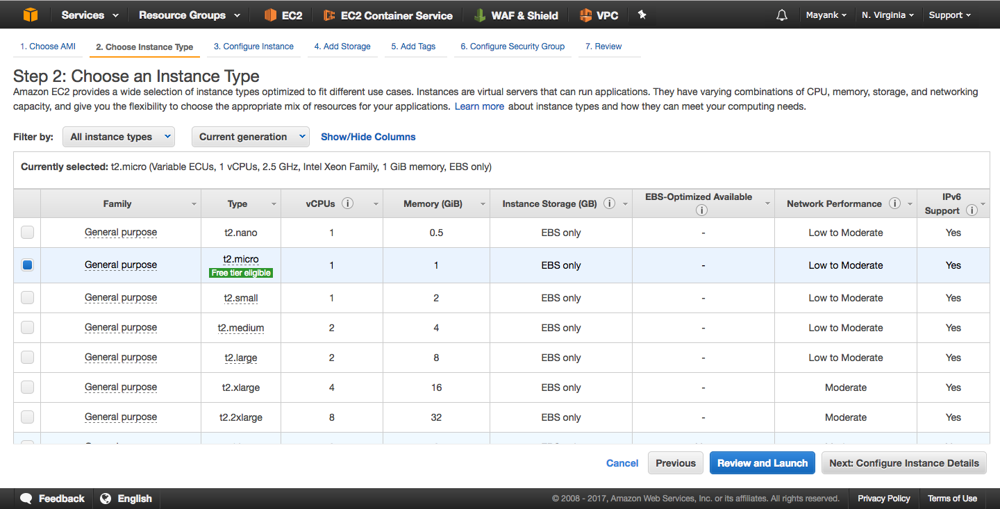
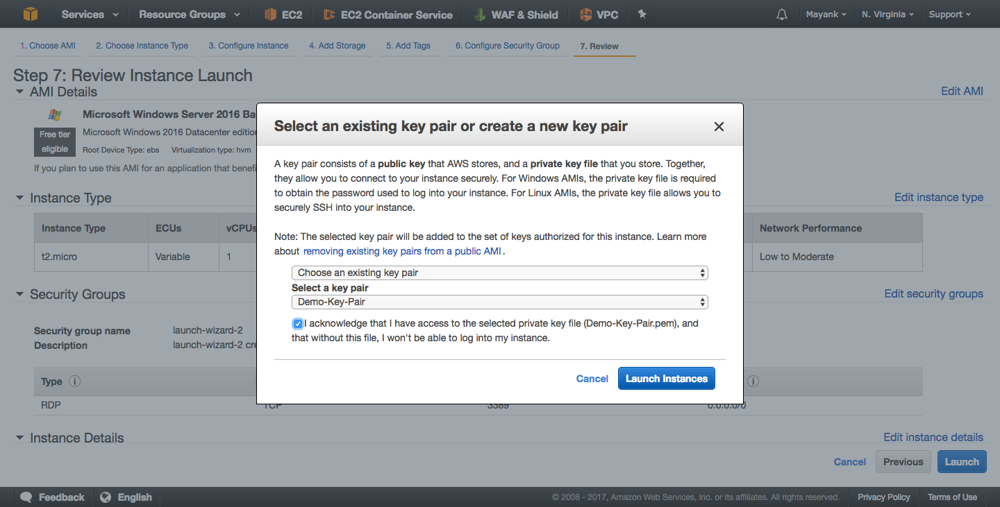

# [Compute in AWS (EC2)](#EC2) #
In this Section we will explore how to launch compute resources in AWS. If you have not already done so, logon to [https://consle.aws.amazon.com](https://consol.aws.amazon.com) to gain access to the AWS dashboard. Once you have logged in, near the top left you will notice a "Service" drop down which lists all of your services availible that you can subscribe to and consume for your cloud infrastructure. For configuring our cloud's computer resources, we will primarily be working in the EC2 dashboard. Click on EC2 under services to enter the [EC2 dashboard](https://console.aws.amazon.com/ec2/). 

Once you're in the [EC2 dashboard](https://console.aws.amazon.com/ec2/), you will notice in the top right my selected region is *N. California*. This designates where my resources in the cloud will be geographically residing. Each Region consists of multiple Availiblity Zones for high availiblity to mitigate your failure domain. You can view how many and which availibility zones are availible for given regions on AWS' website within the EC2 dashboard. In this tutorial, we will be concerning ourselves with 1 region and 1 availiblity zone to deploy all our compute resources on the pre-provisioned networking resources we configured in the prior [VPC tutorial](../VPC/)

##  [Overview](#EC2-Overview) ##
Before we begin, I want to outline our objectives in this tutorial. In this tutorial we will launch 2 virtual machines which are also known as [EC2 instances](https://aws.amazon.com/ec2/details/) in AWS:
  
  1. A [Windows 2016 Server EC2 instance](https://aws.amazon.com/marketplace/pp/B01M7SJEU7?ref=cns_srchrow) on the Client Subnet
  2. A [Linux Ubuntu EC2 Instance](https://aws.amazon.com/marketplace/pp/B01JBL2M0O?qid=1493848518901&sr=0-1&ref_=srh_res_product_title) on the Server Subnet

We will also configure a static public IP aka [Elastic IPs (EIP)](http://docs.aws.amazon.com/AWSEC2/latest/UserGuide/elastic-ip-addresses-eip.html) to the Windows EC2 instance for external RDP access and then use the Windows machine to SSH via Putty into the Linux EC2 instance to set up docker and a few websites.

Lets begin by launching our first EC2 instance. 

## [Launch a Windows Server 2016 EC2 Instance (Client Network)](#EC2-Windows) ##

> It is assumed you have already created an SSH-Key Pair at this point. If you have not, follow instructions in the [s3 tutorial](../S3/ReadMea.md#a-File-S3) "Upload a File to a S3 Bucket"

Click on *"Launch Instances"* under *Create Instance* heading within the EC2 Dashboard. Next continue to configure the launch wizard. 

1. **Select Microsoft Windows Server 2016 Base AMI from AWS Market place under Quick Start**
    * [AWS Market](https://aws.amazon.com/marketplace/) place holds all publicly availible AMI or EC2 templates that you can provision
    * Quick start ones are commonly used AMI's
    * Under **AWS Market Place* you an browse through all the official AMI's availible by various Vendors. Here you will find Citrix [NetScaler AMI](https://aws.amazon.com/marketplace/pp/B00AA01BOE?ref=cns_srchrow) as we will see in the next module.
    * You can also browse through community AMI's as well as publish your own AMI's created from EC2 instances into the community store. For [example](https://github.com/cargomedia/vagrant-boxes), this is a Debian based AMI (ami-01220416) for [Vagrant environments](https://www.vagrantup.com/) availible in the community store. 

2. **Next under Instance Type select** ***t2.micro*** **which is [Free Tier Elegible](https://aws.amazon.com/s/dm/optimization/server-side-test/free-tier/free_nc/#details)**
	* In this step of the Wizard you can select various different resource allocations to your EC2 instance. **Note** that pricing varies based on size of the isntance. 

3. **Next under Configure Instance Details you will specify networking and other configurations**
	* **Number of Instances** will allow you to provision multiple simultaneously. 
		* **Enter 1** for single instance
	
	* **Purchasing option** gives you the oppertunity to bid on an instance and provision [spot instances](https://docs.aws.amazon.com/AWSEC2/latest/UserGuide/using-spot-instances.html?icmpid=docs_ec2_console) to reduce compute costs with the trade of flexible around when your applications run and if your applications can be interrupted. 	  
		* **Uncheck Spot Instance**
	
	* **Network** defines which VPC your EC2 will reside in. This binds the EC2 to the networks assocaited in your virtual private cloud
	    * **Select the [Demo-VPC](../VPC/README.MD#VPC)** we created in the VPC module.

	* **Subnet** chooses which network your EC2 will reside in. Here is what determins what IP space the Instance will obtain an IP in as well as the routes it has availible to route traffic with the subnet's associated Route Table. 
	    * **Select the [Client Subnet](../VPC/README.MD#Client-Subnet)** to provision this instance to.
	
	* **Auto-assign Public IP** applicable for public subnets with a default route through the Internet Gateway allows isntances to be accessed directly with public IPs which are ephemeral. These public IP's are associated dynamically with the instance only during up time of the isntance. These IP's are released into a pool when the instance is turned off and a new one is associated upon reboot. These Public IP's are **not** static. 
		* **Select Enable** so we can later RDP into this VM and access it directly via the public IP. 

	* **Domain Join Directory** enables you to join your instance to a directory you've defined in [AWS Directory Service](http://docs.aws.amazon.com/directoryservice/latest/admin-guide/what_is.html) which is similar to Microsoft Active Directory. It gives you a single sign-on and centralized management experience across a network of Windows instances.
		* **Select None** for our usecase

	* **IAM Role** as discussed earlier is for [Identiy Access Management](https://docs.aws.amazon.com/AWSEC2/latest/UserGuide/iam-roles-for-amazon-ec2.html?icmpid=docs_ec2_console). For EC2, IAM roles automatically deploys and rotates AWS credentials for you, removing the need to store your AWS access keys with your application to make AWS API calls.
		* **Select None** for our usecase

	* **Shutdown behaviour** specifies upon shutdown of VM, if the isntance will be stopped or terminated. 
		* **Select Stop** for our useacse

	* **Enable termination protection** additionally grants additional layer of verification if the instance is going to be terminated. This helps protect against accidental termination. 
		* **Uncheck Protect against accidental termination** for our usecase. 

	* **Monitoring** allows AWS to collect logs assocaited with the instance via [Cloud Watch](https://aws.amazon.com/cloudwatch/details/) to collect and track metrics, collect and monitor log files, set alarms, and automatically react to changes in your AWS instances
		* **Uncheck Enable CloudWatch detailed monitoring** for our usecase.

	* **Tenancy** gives you the option to run your instances on physical servers fully dedicated for your use. The use of host tenancy will request to launch instances onto [Dedicated hosts](https://aws.amazon.com/ec2/dedicated-hosts/), while the use of dedicated tenancy will launch instances as [Dedicated instances](https://aws.amazon.com/dedicated-instances/). You can launch an instance with a tenancy of host or dedicated into a Dedicated VPC.
		* **Select Shared - Run a shared hardware instance** for our usecase

	* **Network Interfaces** by default create a single vNIC for the instance (eth0). The first and default interface on the instance is it's "default" [Elastic Network Interface (ENI)](http://docs.aws.amazon.com/AWSEC2/latest/UserGuide/using-eni.html). During this step you can specify a static priate IP within the subnet or allow an IP to be allocated based on DHCP. 
		* **Enter 172.16.30.10 under Primary IP** but note you can add additional private IPs that the instance can own assocaited with a particular ENI. You will also see later when we deploy NetScaler ADC, we will manage ENI private IPs that will be used as VIPs for Load Balancing. 

4. **Next under Add Storage pane, we will associate block volumes to the EC2 Isntances**
	* Here we associate block storage to the instances where all filesystem, OS, and perisstent data will be stored for the EC2 instance. These volumes are known as [EBS volumes](https://aws.amazon.com/ebs/details/) in AWS. EBS can be elastic in relation to their storage size, IOPs, and Encryption. 
		* **Enter 30GB for size and General Puporse for Volume Type** for our use case. 

5. **Next under Add Tags we can specify Key Value pairs to reference and index the EC2 instance**
      * We won't set any tags here for now.

6. **Configure [Security Groups](http://docs.aws.amazon.com/AWSEC2/latest/UserGuide/using-network-security.html#vpc-security-groups) for firewall rules that control network traffic to your instance.**
	* **Assign a new security group** and we will stick to the **default values** of only allowing RDP connections from *any* source IP to the instance. 
	* **Note** that this does mean ICMP/ping traffic will be blocked along with any other port or protocol to that machine from any other end client within or outside the VPC. 

7. Click **Review and Launch** to review your configurations. 

8. Click Launch to provision your EC2 Instance.
	* Once you click Launch you will be asked to create or associaate an SSH key pair to the instance. 
	* This key pair is crucial and the only way to retrieve your machine's username and password credentials for Windows EC2 instances
	* This key pair is also crucial for Linux EC2 instances where this SSH key pair is used to SSH into the machine. 
	* Without having the delegated keypair, you may very will be locked out of your instance. 
	* **Choose the existing key pair : Demo-Key-Pair** that was created from the [S3 tutorial](../S3/README.md)

## [Overview EC2 Launch Wizard for Windows Server 2016 Instance](#EC2-Windows-Overview) ##

Here is an animation going through the EC2 launch wizard for our usecase. 

### [RDP into Windows EC2 Instance](#Windows-RDP) ###

In this section we will RDP into the Windows machine 

## [Launch a Linux EC2 Instance (Server Network)](#Linux-EC2) ##
Click on *"Instances"* on the left column and begin by clicking *"Launch Instance"* button and then follow the wizard. 

### [EC2 Launch Wizard](#Linux-EC2-LaunchWizard) ###

Here you will only to specify:

### [SSH into Linux EC2 Instance](#SSH-Linux-EC2) ###

PLACE HOLDER

### [Mount EFS volumes on the host](#Linux-EFS-Mount) ###

PLACE HOLDER

### [Host Webservers on port 80, 81, 82](#Host-Webservers) ###

PLACE HOLDER

### [Configure Custom Security Groups Rules](#Linux-Security-Groups) ###

PLACE HOLDER

## [Summary](#EC2-Summary) ##

PLACE HOLDER of Network Topology after completion
	
 

