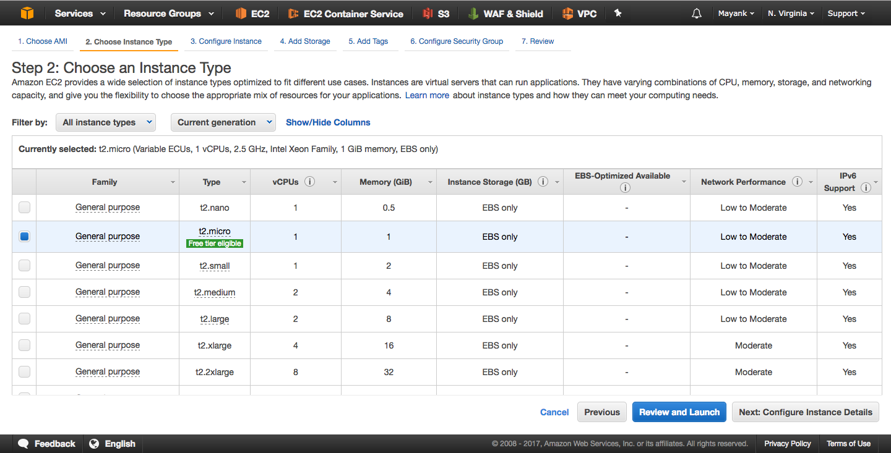
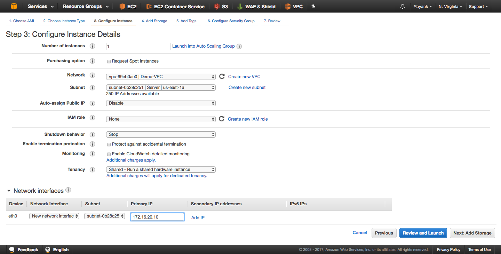
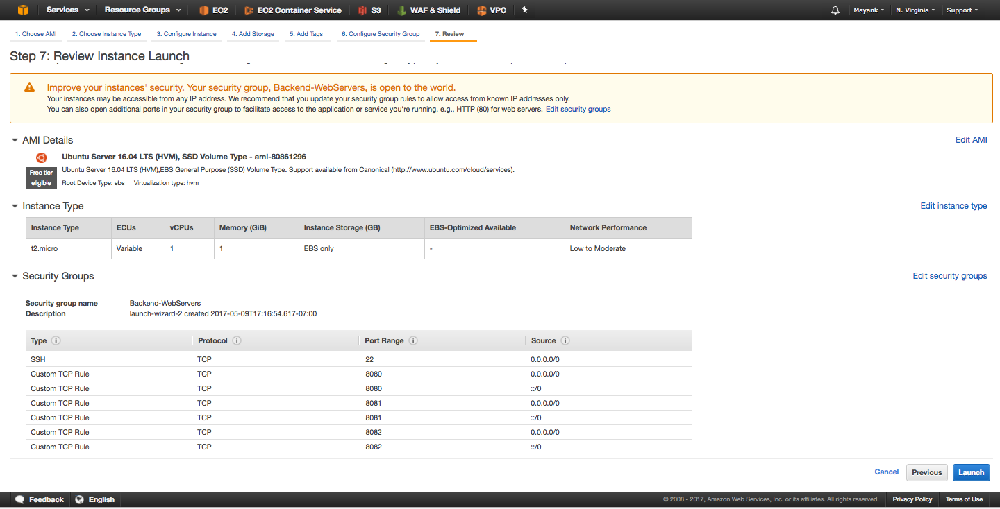
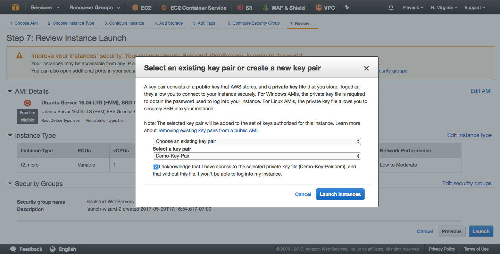
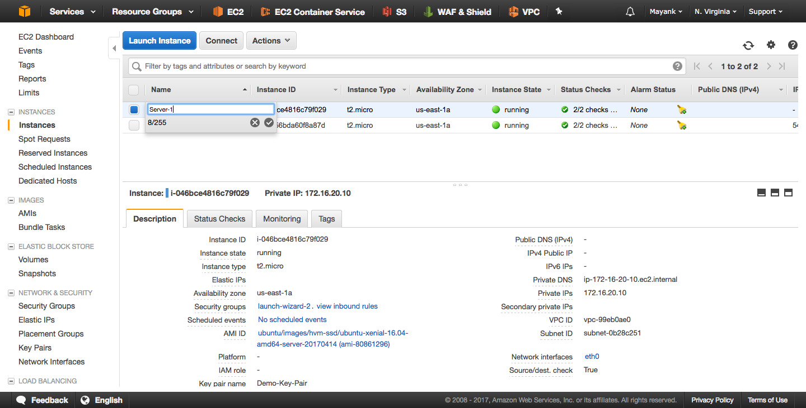
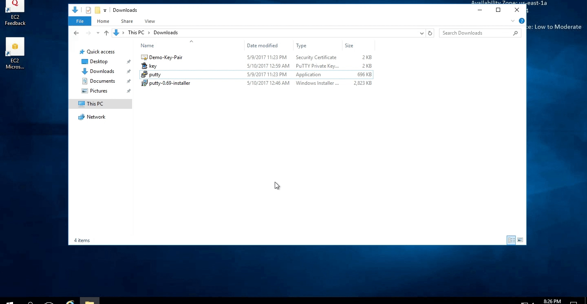

# [Launch a Linux EC2 Instance (Server Network)](#Linux-EC2) #

So far you should have deployed a [Windows 2016 EC2 instance](../Windows-EC2/README.MD) that we can RDP into. However for hosted services, backend servers are often linux based compute servers. In this section we will deploy a Linux Instance on a private subnet that has  outbound access to the internet for updates and apt-packages but no direct acess for clients from the internet. We will use the Windows Machine as a [bastion host](https://aws.amazon.com/blogs/security/controlling-network-access-to-ec2-instances-using-a-bastion-server/) to SSH into this instance and configure some web hosted services that we can access only within our Virtual Private Network. Later when we [deploy NetScaler ADC](../Deploy-NS/README.md), we will set up external access in a private back-end subnet via our NetScaler reverse proxy.

Lets beign by launching an Ubuntu instance, similar to how we did for our Windows 2016 server. 

Click on *"Launch Instances"* under *Create Instance* heading within the [EC2 dashboard](https://console.aws.amazon.com/ec2/). Next continue to configure the launch wizard. 


## 1. Select Ubuntu Server 16.04 LTS AMI from AWS Market place under Quick Start ##


  * [AWS Market](https://aws.amazon.com/marketplace/) place holds all publicly availible AMI or EC2 templates that you can provision
  * Quick start ones are commonly used AMI's
  * Under *AWS Market Place* you an browse through all the official AMI's availible by various Vendors. Here you will find Citrix [NetScaler AMI](https://aws.amazon.com/marketplace/pp/B00AA01BOE?ref=cns_srchrow) as we will see in the next module.
  * You can also browse through community AMI's as well as publish your own AMI's created from EC2 instances into the community store. For [example](https://github.com/cargomedia/vagrant-boxes), this is a Debian based AMI (ami-01220416) for [Vagrant environments](https://www.vagrantup.com/) availible in the community store. 


## 2. Next under Instance Type select ***t2.micro*** ** which is [Free Tier Elegible](https://aws.amazon.com/s/dm/optimization/server-side-test/free-tier/free_nc/#details) ##
	* In this step of the Wizard you can select various different resource allocations to your EC2 instance. **Note** that pricing varies based on size of the isntance. 


## 3. Next under Configure Instance Details you will specify networking and other configurations ##

* **Number of Instances** will allow you to provision multiple simultaneously.
  > Enter **1** for single instance
  
* **Purchasing option** gives you the oppertunity to bid on an instance and provision [spot instances](https://docs.aws.amazon.com/AWSEC2/latest/UserGuide/using-spot-instances.html?icmpid=docs_ec2_console) to reduce compute costs with the trade of flexible around when your applications run and if your applications can be interrupted. 	  
  > Uncheck Spot Instance
  
* **Network** defines which VPC your EC2 will reside in. This binds the EC2 to the networks assocaited in your virtual private cloud
  > Select the [Demo-VPC](../VPC/README.MD#VPC)** we created in the VPC module.
  
* **Subnet** chooses which network your EC2 will reside in. Here is what determins what IP space the Instance will obtain an IP in as well as the routes it has availible to route traffic with the subnet's associated Route Table.
   > Select the **[Server Subnet](../VPC/README.MD#Server-Subnet)** to provision this instance to.
	 
* **Auto-assign Public IP** applicable for public subnets with a default route through the Internet Gateway allows isntances to be accessed directly with public IPs which are ephemeral. These public IP's are associated dynamically with the instance only during up time of the isntance. These IP's are released into a pool when the instance is turned off and a new one is associated upon reboot. These Public IP's are **NOT** static. 
  > Select Disable given this instance is provisioned in a private subnet. 

* **Domain Join Directory** enables you to join your instance to a directory you've defined in [AWS Directory Service](http://docs.aws.amazon.com/directoryservice/latest/admin-guide/what_is.html) which is similar to Microsoft Active Directory. It gives you a single sign-on and centralized management experience across a network of Windows instances.
  > Select None for our usecase

* **IAM Role** is for [Identiy Access Management](https://docs.aws.amazon.com/AWSEC2/latest/UserGuide/iam-roles-for-amazon-ec2.html?icmpid=docs_ec2_console). For EC2, IAM roles automatically deploys and rotates AWS credentials for you, removing the need to store your AWS access keys with your application to make AWS API calls.
  > Select None for our usecase

* **Shutdown behaviour** specifies upon shutdown of VM, if the isntance will be stopped or terminated. 
  > Select **Stop** for our useacse

* **Enable termination protection** additionally grants additional layer of verification if the instance is going to be terminated. This helps protect against accidental termination. 
  > Uncheck Protect against accidental termination for our usecase. 

* **Monitoring** allows AWS to collect logs assocaited with the instance via [Cloud Watch](https://aws.amazon.com/cloudwatch/details/) to collect and track metrics, collect and monitor log files, set alarms, and automatically react to changes in your AWS instances
  > Uncheck Enable CloudWatch detailed monitoring for our usecase.

* **Tenancy** gives you the option to run your instances on physical servers fully dedicated for your use. The use of host tenancy will request to launch instances onto [Dedicated hosts](https://aws.amazon.com/ec2/dedicated-hosts/), while the use of dedicated tenancy will launch instances as [Dedicated instances](https://aws.amazon.com/dedicated-instances/). You can launch an instance with a tenancy of host or dedicated into a Dedicated VPC.
  > Select Shared - Run a shared hardware instance for our usecase

* **Network Interfaces** by default create a single vNIC for the instance (eth0). The first and default interface on the instance is it's "default" [Elastic Network Interface (ENI)](http://docs.aws.amazon.com/AWSEC2/latest/UserGuide/using-eni.html). During this step you can specify a static private IP within the subnet or allow an IP to be allocated based on DHCP. 
  > Enter 172.16.20.10 under Primary IP for a static privte IPv4 address, but note you can add additional private IPs that the instance can own assocaited with a particular ENI. You will also see later when we deploy NetScaler ADC, we will manage ENI private IPs that will be used as VIPs for Load Balancing. 
 


## 4. Next under Add Storage pane, we will associate block volumes to the EC2 Isntances ##

Here we associate block storage to the instances where all filesystem, OS, and perisstent data will be stored for the EC2 instance. These volumes are known as [EBS volumes](https://aws.amazon.com/ebs/details/) in AWS. EBS can be elastic in relation to their storage size, IOPs, and Encryption. 
  > Enter 8GB for size and General Puporse for Volume Type for our use case. 
  


## 5. Next under Add Tags we can specify Key Value pairs to reference and index the EC2 instance ##

We won't set any tags here for now.


## 6. Configure [Security Groups](http://docs.aws.amazon.com/AWSEC2/latest/UserGuide/using-network-security.html#vpc-security-groups) for firewall rules that control network traffic to your instance. ##

Assign a **new security group** and we will configure rules to allow traffic on port 8080, 8081, 8082 and 22 from any source IP. 
  > **Note** that this does mean ICMP/ping traffic will be blocked along with any other port or protocol to that machine from any other end client within or outside the VPC.
   


### 7. Review and Launch your configuration ##



Click Launch to provision your EC2 Instance.

* Once you click Launch you will be asked to create or associaate an SSH key pair to the instance. 
* This key pair is crucial and the only way to retrieve your machine's username and password credentials for Windows EC2 instances
* This key pair is also crucial for Linux EC2 instances where this SSH key pair is used to SSH into the machine. 
* Without having the delegated keypair, you may very will be locked out of your instance. 

> Choose the existing key pair : **Demo-Key-Pair** that was created from the [S3 tutorial](../S3/README.md)
  


Once provisioned, name the instance under **`EC2 > Instances`** name the new Ubuntu instance `Server-1`



## [Overview EC2 Launch Wizard for Ubuntu Server Instance](#EC2-Ubuntu-Overview) ##

Here is an animation going through the EC2 launch wizard for our usecase.


## [SSH into Linux EC2 Instance, Update, and Install Pre-Reqs](#SSH-Linux-EC2) ##

Now that our Linux Instance is up and running, we will now attempt to SSH from our Windows 2016 Server instance. This will be inter-VPC network traffic where the request will originate from our **Cleint Subnet** that is destined to our **Server Subnet** within our **Demo VPC**

In your windows instance, open up putty and load the saved `Server-1` session we configured earlier and you will be presented with CLI access to the ubuntu machine. 

Lastly, do and update and upgrade on the host to get everything up to latest versions with the following command: 

`sudo apt-get -y update`



Next install [Docker](https://www.docker.com/what-docker) as a pre-requisite to quickly host web services on the Ubuntu EC2 Instance. Type the following command in CLI.

`sudo apt-get -y install docker.io`


Next we will need to mount the EFS volume we configured earlier in the [EFS Module](../EFS/README.md). Before we can mount it, we need to install NFS client package. Enter the following in the Ubuntu server's CLI: 

`sudo apt-get -y install nfs-common`


# [Mount EFS volumes on the host](#Linux-EFS-Mount) #

In this section we will mount [our Amazon EFS file system](../EFS/README.md) upon boot. To automatically mount our Amazon EFS file system directory when the Amazon EC2 instance reboots, we will make edits to the `fstab` file within the instance. The fstab file contains information about network file systems, and the command `mount -a`, which runs during instance startup and mounts the file systems listed in the fstab file. There are two ways to set up automatic mounting.

1. First lets make a new folder to mount the file system to. Enter the following command to create a new directory: 

`mkdir /data` 

2. Next append the following line to the`/etc/fstab` file  with the following command: 

```bash
sudo echo "**fs-6678c12f.efs.us-east-1.amazonaws.com**:/ /data nfs4 nfsvers=4.1,rsize=1048576,wsize=1048576,hard,timeo=600,retrans=2 0 0
" >> /etc/fstab
```
> Note that the `fs-6678c12f.efs.us-east-1.amazonaws.com` entry is unique to my use case. It is the DNS name of my EFS that I created. **Yours will be different than shown here.** If you do not remember the DNS name of your EFS mount point, navigate to the [EFS dashboard](https://console.aws.amazon.com/efs/) and check the details for the **Demo-EFS** EFS volume. 

3. Lastly, re-mount all the volumes in your `fstab` file to see changes by entering the following command: 

`mount -a -t nfs4`


# [Host Webservers on port 80, 81, 82](#Host-Webservers) #

PLACE HOLDER

# [Configure Custom Security Groups Rules](#Linux-Security-Groups) #

PLACE HOLDER


# [Summary](#EC2-Summary) #

PLACE HOLDER of Network Topology after completion
	
 


