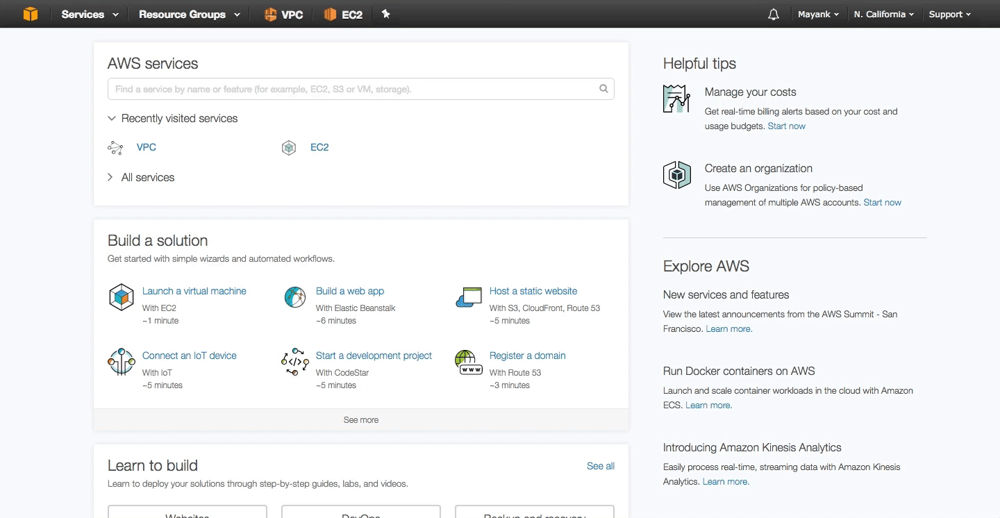
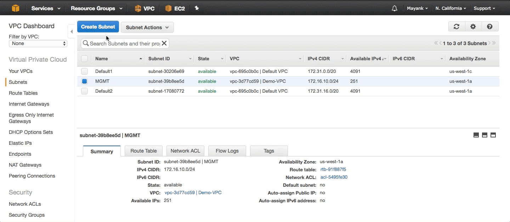

# Introduction to AWS and NetScaler
In this tutorial, we will explore the basics of AWS when provisioning Network resources, Compute resources, and Storage Resources. After learning the basics and configuring pre-requisite networking, we will then deploy NetScaler ADC in AWS to show how you can Load Balance a simple Website hosted on an EC2 instance via the NetScaler ADC. 

As a pre-requisite for this tutorial, please sign up and create your own AWS Free Tier account from the [sign in page](https://console.aws.amazon.com/console/home)

## Networking in AWS (VPC)
In this Section we will explore how to configure cloud networking in AWS. If you have not already done so, logon to [htps://consle.aw.amazon.com](consol.aws.asazon.com) to gain access to the AWS dashboard. Once you have logged on, in the top left you will notice a "Service" drop down which lists all of your services availible that you can subscribe to and consume for your cloud infrastructure. For configuring our cloud's networking resources, we will primarily be working in the VPC dashboard. Click on VPC under services to enter the VPC dashboard. 

Once you're in the VPC dashboard, you will notice in the top right my selected region is *N. California*. This designates where my resources in the cloud will be geographically residing. Each Region consists of multiple Availiblity Zones for high availiblity to mitigate your failure domain. You can view how many and which availibility zones are availible for given regions on AWS' website. In this tutorial, we will be concerning ourselves with 1 region and 1 availiblity zone to deploy all our networking resources as you'll soon see.

### Creating a VPC
Before we begin, I want to outline our objectives in this tutorial. In this tutorial we aim to create our very own [Virtual Pivate Cloud](http://docs.aws.amazon.com/AmazonVPC/latest/UserGuide/VPC_Subnets.html) which lets us provision logically isolated sections of the the cloud where we can later launch AWS resources like virtual machines, also known as EC2 instances, in virtual networks that we will create within the VPC. 

We will create three of these virtual networks also known as [subnets](http://docs.aws.amazon.com/AmazonVPC/latest/UserGuide/VPC_Subnets.html). 

1. One subnet will be created for **management** as a private subnet with no access to the internet what so ever.
2. One subnet will be created for back-end **servers** as a private subnet with only outbount access to the internet for software updates for example. 
  * **Note**: virutal machines or EC2 instances deployed in this private subnet of VPC cannot be accessed from the Internet directly because you cannot assign them a public IP. We'll see why shortly.
  
3. One subnet will be created for **client** facing traffic as a public subnet which has outbound and static IP mapping capability for direct inbound access from the internet. 

Lets begin by creating our first VPC. Click on *"Your VPCs"* on the left column and notice that a default VPC has already been created for us. This is out of the box configuration from AWS to quickly deploy compute resources. However, we will ignore the defaults and be explicit in creating our own networks.

Begin by clicking *"Create VPC"* button on top and then follow the wizard. 

In the creation wizard, you will only need to specify

1.  Name: `Demo-VPC`
2.  CIDR block : `172.16.0.0/16`
	  * This CIDR block will encompass all your availible IP's within the VPC to segment out into specific subnets and networks.
3. Click *Yes Create* and continue. 

### Creating Three Subnets

Now we will create the three subnets outlined above. Click on *Subnets* on the left pane and then click the *Create Subnet* button for each new subnet to be created. Here we will give the following subnets the following parameters: 

###Management Subnet:***#

  * **Name** `MGMT` for management traffic
  * **VPC** `Demo-VPC`
  * **IPv4 CIDR Block** range of `172.16.10.0/24`
  * **Availibility Zone** `us-west-1a`
  * **Note:** In subsequent steps, we will ensure that this subnet will not have any access to and from the internet.

***Server Subnet:***

  * **Name** `Server` for private back-end server traffic
  * **VPC** `Demo-VPC`
  * **IPv4 CIDR Block** range of `172.16.20.0/24`
  * **Availibility Zone** `us-west-1a`
  * **Note:** In subsequent steps, we will ensure that this subnet will only have outbound access to the internet and that no direct connections from the internet can be established. We will configure a [NAT Gateway](http://docs.aws.amazon.com/AmazonVPC/latest/UserGuide/vpc-nat-gateway.html) for this use case.

***Client Subnet***

  * **Name** `Client` for Direct web-facing internet traffic. 
  * **VPC** `Demo-VPC`
  * **IPv4 CIDR Block** range of `172.16.30.0/24` 
  * **Availibility Zone** `us-west-1a`
  * **Note:** In subsequent steps, we will configure the ability for resources deployed in this network to have direct access to and from the internet with Public IPs. We will configure an [Internet Gateway](http://docs.aws.amazon.com/AmazonVPC/latest/UserGuide/VPC_Internet_Gateway.html) for this use case.

### Creating Three Route Tables

We will now configure routing to and from each subnet within the VPC. Click n *Route Table* on the left pane. Here we will configure three route tables for the three different types of subnets we have. By default one is already created for us which is by default the *main* route table for the VPC that all subnets are *implicitly* associated with. 

***Configure the MGMT Subnet Default Route Table***

Click on the *No Named* route table and examine the route entries on that table.   The main route table for our *Demo-VPC* as you'll see is our automatically created by default with only one route entry. Rename that route table to `MGMT-RT`. Under the *Routes* tab, you'll see the single entry shows a destination route to any IP in the `172.16.0.0/16` range which makes up our whole VPC. In short, this states any IP in any subnet has a direct local route to any other IP within the VPC. Note that there is no route to the internet. 

***Create and Configure the Server Subnet's Route Table***

We will now require an additional route table for the **Server** subnet which will have access to any destination IP within the VPC as well as a default gateway entry in the route table to reach the internet for out-bound access. Servers on this network will need to be able to pull updates and packages from the interne thus they will require a gateway for appropriate routing. Before we create the route table, we will first create a NAT Gateway for out bound internet access. 

1. Click on *NAT Gateways* on the left pane and then click on *Create NAT Gateway* GUI button at the top.
2. Under *Subnet* select the **Server** subnet and then click *Create new EIP*. EIP stands for [Elastic IP](http://docs.aws.amazon.com/AWSEC2/latest/UserGuide/elastic-ip-addresses-eip.html#eip-basics}) which is a public, static IP now associated with this NAT gateway. The NAT gateway will use this IP to [masquerade](http://www.oreilly.com/openbook/linag2/book/ch11.html) outbound connections via NAT so the source IP for any internet bound connection will be of the NAT Gateway's EIP.

3. Once a NAT Gateway is configured, navigate back to the *Route Tables* configurations and Create a new Route Table named `Server-RT` in the `Demo-VPC`. 
4. Explicitly associate only the **Server** Subnet to this route table.
5. Next add a new entry for a default route `0.0.0.0/0` targeting the NAT Gateway (Auto populated on drop down).

***Create and Configure the Client Subnet's Route Table***

Lastly we will now create one last route table for the **Client** subnet which will have access to any destination IP within the VPC as well as a default gateway entry in the route table to reach the internet for out-bound access. However, resources on this network will also need to be able to have public IP's  [EIPs](http://docs.aws.amazon.com/AWSEC2/latest/UserGuide/elastic-ip-addresses-eip.html#eip-basics}) associated with them for direct request from end clients comming in from the internet. Thefore an [Internet Gateway](http://docs.aws.amazon.com/AmazonVPC/latest/UserGuide/VPC_Internet_Gateway.html) will be used for this subnet for outbound and inbound direct internet access. 

1. Click on *Internet Gateways* on the left pane and then click on *Create Internet Gateway* GUI button at the top.
2. Give the Internet Gateway the name `IG-Demo`
3. Select the Internet Gateway and attach it to the **Demo-VPC**. 

3. Once an Internet Gateway is configured, navigate back to the *Route Tables* configurations and Create a new Route Table named `Client-RT` in the `Demo-VPC`. 
4. Explicitly associate only the **Client** Subnet to this route table.
5. Next add a new entry for a default route `0.0.0.0/0` targeting the Internet Gateway (Auto populated on drop down).

###Summary###

In this tutorial, you have created a 

