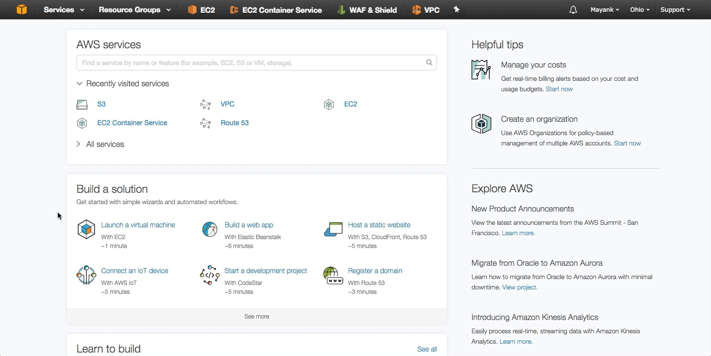

# [Object Storage in AWS (S3)](#S3) #

In this Section we will explore how to create object stores to keep data within AWS. If you have not already done so, logon to [https://consle.aws.amazon.com](https://consol.aws.amazon.com) to gain access to the AWS dashboard. Once you have logged in, near the top left you will notice a "Service" drop down which lists all of your services availible that you can subscribe to and consume for your cloud infrastructure. For configuring our cloud's object storage resources, we will primarily be working in the S3 dashboard. Click on S3 under services to enter the [S3 dashboard](https://console.aws.amazon.com/S3/). 

##  [Overview](#S3-Bucket) ##
Before we begin, I want to outline our objectives in this tutorial. In this tutorial we will set up AWS S3 to store file ans objets for retrieval from other  [EC2 instances](https://aws.amazon.com/ec2/details/) in AWS. 
  
  1. We will create an S3 Bucket
  2. We will store files in the S3 bucket:
    * A private SSH key
    * Putty.exe for SSH on Windows
  3. We will then retrieve the data we put in the S3 bucket

Lets begin by creating our very first S3 bucket. 

##  [Create a S3 Bucket	](#S3-Bucket) ##

First off we will begin by creating our first S3 bucket. Click *Create Bucket* and follow the wizard. Give it a name `S3-Demo` in the same region as your VPC and continue. Next enable all features of logging (to the newly created bucket), Version Control, and create a new tag with the *key* `demo` and *value* `S3. 

**Enable Logging** In order to track requests for access to your bucket

**Enable Version Control** as means of keeping multiple variants of an object in the same bucket. You can use versioning to preserve, retrieve, and restore every version of every object stored in your Amazon S3 bucket.

**Enable Tagging** Enables you to categorize storage where rach tag is a key-value pair that can be used for indexing and organization. 

For now **set permissions** to the logged in admin user to be able to read/write. Ideally one would have pre-configured [IAM accounts](https://aws.amazon.com/iam/details/) for RBAC on S3 API calls to select from. Permissions and accounts will be unique to the workflow and/or applications using the bucket for data storage.

Lastly review and confirm configuration.

You should now see a newly created bucket in the S3 console. You can drill into the bucket and see there are currently no files inside or some small failes titled begning with *undefined*. These files are likley log files AWS stored since we enabled logging. 

You will also notice the ability to manually upload a file into the bucket from the S3 console. You can also create folders for organization purposes. 

You also have many more options to do things such as encrypt, rename, download as, etc. to files within the bucket from the console.

Under the **Properties** tab you can enable additional features such a cross region sync, static website hosting, etc. Under the **Permissions** tab you can manage RBAC for your IAM users. Lastly, under the **Management** tab you have access to advanced features such as lifecycle rules to automate and manage your objects, colelct analytics, metric, and better account for files and object inventory within the bucket. 

Poke around and gain familiarity with the console and service. In the next section we will upload files into the bucket to later retrieve them.

## [Upload Files to a S3 Bucket](#a-File-S3) ##

With a bucket created, you have a place to store all your objects and files. Now lets do the uploading and storing some so to see how S3 fundementally works. 

First we'll beign by creating a new SSH Key-pair that AWS can use to generate login credentials to provisioned cloud instances. If you are unfamiliar with AWS and SSH key-pairs refer to the [following link](http://docs.aws.amazon.com/AWSEC2/latest/UserGuide/ec2-key-pairs.html) for more details. 

We will only download and store a keyfile mannually in the S3 Bucket. later in the [EC2 tutorial](EC2/README.md) we will use the Key File to access a linux server.

Navigate to the EC2 dashboard [EC2 dashboard](https://console.aws.amazon.com/ec2/) 

Then navigate to **Key Pairs** on the left panel and click "**Create Key Pair**". Give the Kay Pair a name **Demo-Key-Pair** and save the ssh key file locally. 
	
Now navigate to the S3 bucket via the S3 console to upload the file using the **Upload** GUI button.

This concludes an upload of a file into a S3 bucket. It should be noted that you should never put AWS SSH Keys in an unrestricted S3 Bucket. Also, this module was to explicitly show you how files can be uploaded into newly created S3 Buckets. In real workflows, all of what was done here is usually automated via S3 API calls. [IAM service accounts](https://aws.amazon.com/iam/details/) with appropriate permissions can create Buckets, put files into the bukets, and delete files as needed dynamically.

Similar to how you uploaded an SSH key file, upoad a [portable Putty.exe](https://the.earth.li/~sgtatham/putty/latest/w32/putty.exe) for later use in the [EC2 tutorial](EC2/README.md) to SSH into Linux VM's from Windows cliets.

## [Download a File from an S3 Bucket](#Download-File-S3) ##

Now that we have two files in S3 buckets, we will enable them to be publicly availible for download via a direct links. 

Click on your desired file for more details. At th ebottom of the page you will see a link to the file. If you click that link and open it in an incognito window, you will receive an Access Denied. To make Public, click the **Make Public** button at the top of the web page and then try accessing the file's endpoint link again. You will be able to now download the file directly from the AWS S3 bucket.

## [Summary](#S3-Summary) ##

In this simple tutorial you created your very first S3 bucket via AWS S3 Dhasboard and uploaded two files that were made publicly availble through extenral URLS. These files will later be used in the [EC2 tutorial](EC2/README.md) and later we will create a new service that dynamcially stores data in a S3 buckets via API calls in the background for a hosted web service.

 

